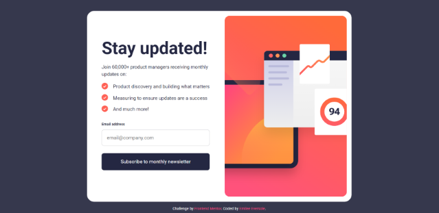
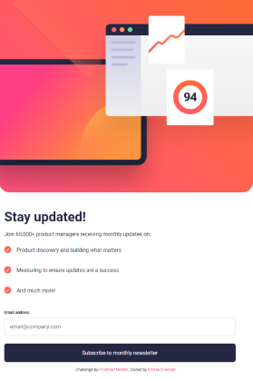
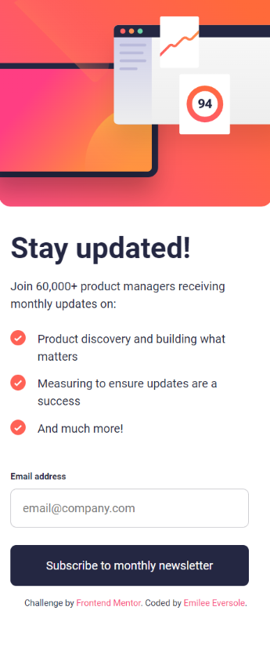

# Frontend Mentor - Product preview card component solution

This is a solution to the [Newsletter sign-up form with success message challenge on Frontend Mentor](https://www.frontendmentor.io/challenges/newsletter-signup-form-with-success-message-3FC1AZbNrv). Frontend Mentor challenges help you improve your coding skills by building realistic projects. 

## Table of contents

- [Overview](#overview)
  - [The challenge](#the-challenge)
  - [Links](#links)
- [Finished Product](#finished-product)
- [My process](#my-process)
  - [Built with](#built-with)
  - [What I learned](#what-i-learned)
  - [Continued development](#continued-development)
- [Author](#author)
- [Acknowledgments](#acknowledgments)

## Overview

### The challenge

Users should be able to:

- Add their email and submit the form
- See a success message with their email after successfully submitting the form
- See form validation messages if:
  - The field is left empty
  - The email address is not formatted correctly
- View the optimal layout for the interface depending on their device's screen size
- See hover and focus states for all interactive elements on the page

### Links

- Solution URL: [GitHub](https://emileeeversole.github.io/FEM-Newsletter-Sign-Up-with-Success-Page/)

## Finished Product
Desktop (1440px)

Tablet (768px)

Mobile (375px)

## My process

### Built with

- HTML5
- CSS
- JavaScript

### What I learned

This was my first challenge with the "junior" difficulty level. I tried to work on a combination of layout types and used flex for some aspects and grid for others. This project was very beneficial to my CSS skills. In relation to JavaScript, it was very similar to the previous email sign-up challenge I did, and I was very glad that I remembered the concepts and was able to recreate it! 

### Continued development

I'm still working on figuring out what works best for me when it comes to designing the layout. For some projects, I feel like I've got a system that works perfectly. For others, it feels like I have no idea what I'm doing or where to start. More practice is key! 

## Author

- GitHub - [@EmileeEversole](https://github.com/EmileeEversole)
- Frontend Mentor - [@EmileeEversole](https://www.frontendmentor.io/profile/EmileeEversole)

## Acknowledgments

Today I'm thankful for my mom, who cooks for me way more than she should <3
